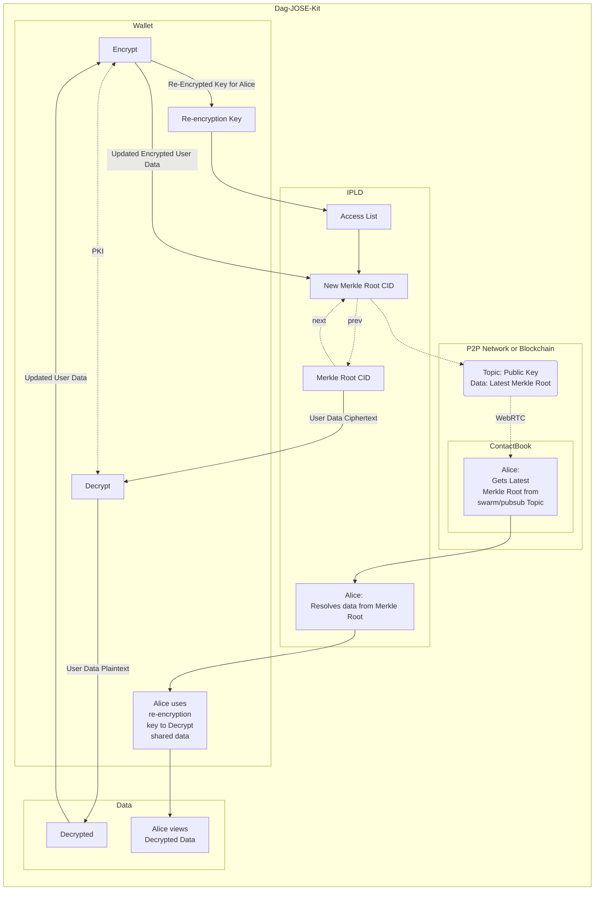

# DAG JOSE Proxcryptor SDK

Save and retrieve encrypted data [CIDs](https://cid.ipfs.tech/) to IPFS [DAG](https://github.com/ipfs/js-ipfs/blob/master/docs/core-api/DAG.md). Data can then be decrypted by yourself, or re-encryted to other public keys with the proxcryptor you pass in.

Rolls everything up to a single Root CID, with all previous data located at `prev` for easy reference.



## Installation

```sh
npm install github:peerpiper/dag-jose-kit --save
```

## Usage example

See full demo of how to use the library:

```
./src/routes/index.svelte
```

Run the demo:

1. Clone the repo, then

```
npm run dev
```

# API

## New Proxcryptor

```
import { DagJoseCryptor } from '@peerpiper/dag-jose-kit';

const joseCryptor = new DagJoseCryptor(ipfsNode: IPFS, proxcryptor: Proxcryptor, myRootCID: string | null)
```

`ipfsNode` should be an [IPFS instance](https://github.com/ipfs/js-ipfs/blob/7a7e091c5d7110542ca7ab6eca1c0c9abb19e54b/packages/ipfs-core-types/src/index.ts#L29), `proxcryptor` you can get from the [wallet]() that provides the `Proxcryptor` interface (@peerpiper/iframe-wallet), and myRootCID is a string of a CID where you can optionally start your [DAG](https://docs.ipfs.tech/concepts/merkle-dag/#merkle-directed-acyclic-graphs-dags) from.

## Encrypt (Self-Encrypt)

```
await joseCryptor.put({ data: myData }, tag: string);
```

Once you have a `joseCryptor` instance, you can use it to encrypt objects using a ed25519 keypair from a wallet.

`data` should be an object which can be stored to IPLD via [ipfs.dag.put](https://github.com/ipfs/js-ipfs/blob/master/docs/core-api/DAG.md#ipfsdagputdagnode-options).

`tag` is any string, and is how you access the encrypted object in the future. You may call it something like `Profile`, or `Contacts` or whatever your app prefers.

## Self-Decrypt

```
await joseCryptor.selfDecrypt(tag: string);
```

Once you have encrypted using a `joseCryptor` instance, you can use it to self decrypt your own objects using the same ed25519 keypair used to encrypt it.

`tag` is the same string used to label the object when it was encrypted. Forexample, you may have called it something like `Profile`, or `Contacts` or whatever.

## Grant Access (for someone else to see your data)

```
await joseCryptor.grantAccess(tag: string, theirPublicKey: Uint8Array);
```

Grant access to a tag for someone else's public key. Their key will added to the `REKEY` list for this tag so that they can decrypt your data.

## Check Access (to another user's tag)

```
await joseCryptor.checkAccess(tag: string, yourPublicKey: Uint8Array, theirPublicKey: Uint8Array);
```

Check access allows you to see if your public key is on the access list for someone else's tag. Your key will need to be on their `REKEY` list in order to decrypt their data.

## Decrypt someone else's Tag data

```
await joseCryptor.decryptFromTagNode(tagNode: TagNode, theirPublicKey: Uint8Array)
```

Resolving someone else's `rootCID` will give you a list of their `TagNodes`, which comes with everything the library needs to decrypt the data assuming your public key has been granted access and is on the `REKEY` list (access list).

If your public key is on their access list for the `tag`, then calling `decryptFromTagNode` will recrypt their data for your public/private keypair and return it as a result of this function call.

If you're not on the list, returns `false`.

# Emitted Events

## DAG Updated Event

```
joseCryptor.emitter.on('rootCIDUpdate', (rootCID) => {
  // doSomething with rootCID, like display or persist it
})
```

Once you have encrypted using a `joseCryptor` instance, it emits 'rootCIDUpdate' event once the updated DAG has been created.

This allows your app to listen for update events to display your own fresh data once it's ready.

# Development setup

Note that this library uses the [ES Module](https://developer.mozilla.org/en-US/docs/Web/JavaScript/Guide/Modules) version of IPFS, which isn't available out of the box, so we build ourselves by running:

```sh
npm build:ipfs
```

To get esbuild to run, we need to add `process` and `util` to our dev deps. This will place an es module version of IPFS in `lib/modules` which we can then import to create our dag proxcryptor.

# Meta

Doug Anderson – [@DougAnderson444](https://twitter.com/DougAnderson444) – YourEmail@example.com

Distributed under the MIT license. See `LICENSE` for more information.

[https://github.com/DougAnderson444/dag-jose-kit](https://github.com/DougAnderson444/dag-jose-kit/)

# Contributing

1. Fork it (<https://github.com/DougAnderson444/dag-jose-kit/fork>)
2. Create your feature branch (`git checkout -b feature/fooBar`)
3. Commit your changes (`git commit -am 'Add some fooBar'`)
4. Push to the branch (`git push origin feature/fooBar`)
5. Create a new Pull Request
